<center>
<h1>Project 3: Results Visualization</h1>
* 楊兆尹 <span style="color:red">103020010</span>
<p></p>
* Overview:
The project implements two kinds of image feature representation methods and two kind of classification methods to classify images with 15 categories.

1. Tiny image representation
* Resize the image into a smaller one, reshape it into 1d array, and normalize it.
```
tiny_images = None
N = len(image_paths)
print("#images = {}".format(N))
tiny_images = np.zeros((N, 256))
for i in range(N):
    img = Image.open(image_paths[i])
    W, H = img.size
    size = W if W < H else H
    img_crop = img.crop((0, H-size, size, H))
    img_resize = img_crop.resize((16,16), Image.BICUBIC)
    img_resize_m = np.asarray(img_resize)
    img_1d = np.reshape(img_resize_m, 256)

    # standardize
    average = np.mean(img_1d)
    deviate = np.std(img_1d)
    img_1d_normal = (img_1d - average) / deviate
    tiny_images[i, :] = img_1d_normal
return tiny_images
```

2. Bag of sift representation
* Extract the sift descriptors from the image and locate each descriptor to one of the cluster center in the vocabulary which already clusters descriptors into several groups.
```
image_feats = None
with open('vocab.pkl', 'rb') as voc:
    vocal_feats = pickle.load(voc)
record = np.zeros(vocal_feats.shape[0])
image_feats = np.zeros((len(image_paths), vocal_feats.shape[0]))
for i, path in enumerate(image_paths):
    img = np.asarray(Image.open(path),dtype='float32')
    frames, descriptors = dsift(img, step=[5,5], fast=True)
    L2_dis = distance.cdist(vocal_feats, descriptors, 'euclidean')
    for j in range(descriptors.shape[0]):
        min_index = np.argmin(L2_dis[:, j])
        record[min_index] = record[min_index] + 1
    average = np.mean(record)
    deviate = np.std(record)
    img_normal = (record - average) / deviate
    image_feats[i, :] = img_normal
    record = np.zeros(vocal_feats.shape[0])
return image_feats
```

3. Nearest Neighbor classification
* In this case, we use Euclidean distance to compare testing images and training images. Label the testing image with the label of training image which distance is the smallest.
```
test_predicts = []
#N_train = train_image_feats.shape[0]
N_test = test_image_feats.shape[0]
L2_dis = distance.cdist(train_image_feats, test_image_feats, 'euclidean')
for i in range(N_test):
    min_index = np.argmin(L2_dis[:, i])
    label = train_labels[min_index]
    test_predicts.append(label)
return test_predicts
```

4. SVM classification
* Use svm to classify the images into 15 categories.
```
pred_label = None
clf = LinearSVC(C=1.0 , class_weight=None, dual=True, fit_intercept=True,
               intercept_scaling=1, loss='squared_hinge', max_iter=10000,
                multi_class="ovr", penalty='l2', random_state=0, tol= 1e-5,
                verbose=0)
clf.fit(train_image_feats, train_labels)
pred_label = clf.predict(test_image_feats)
return pred_labels
```


<p>Tiny_Image + NN: Accuracy(tiny+nn) is 0.22</p>
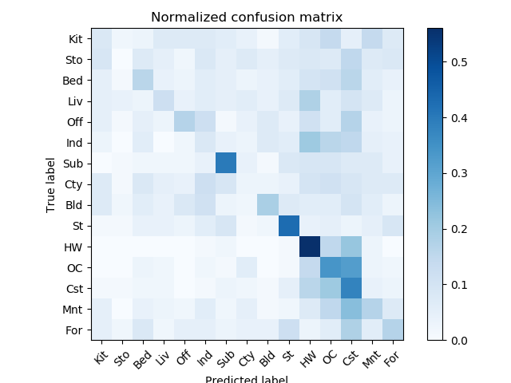

<p>Sift + NN: Accuracy(sift+nn) is 0.52</p>
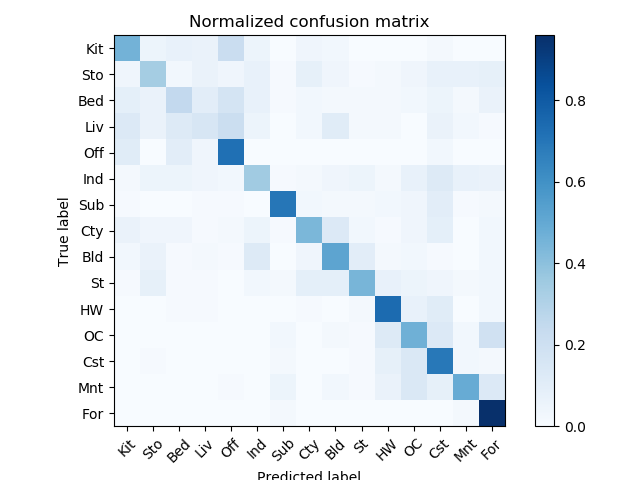


<p>Sift+SVM: Accuracy(sift+svm) is 0.62</p>
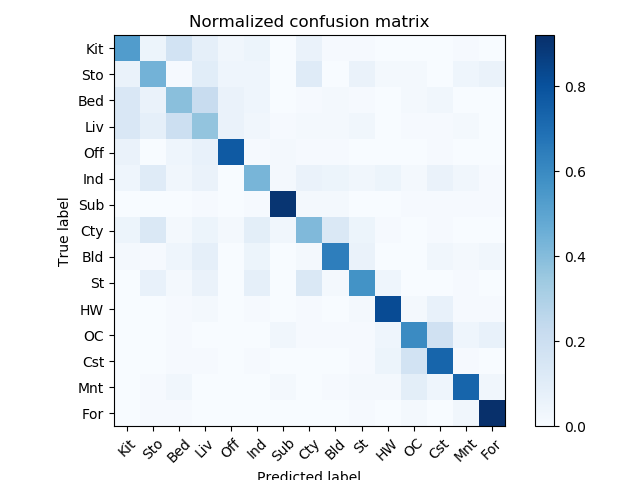

* Note: Here I only show some results of sift+svm. For other mothod combinations, please change the arguments when running the code. you can expect to get approximately 21% and 51% accuracies for tiny_image+nn and sift+nn respectively.

<table border=0 cellpadding=4 cellspacing=1>
<tr>
<th>Category name</th>
<th>Accuracy</th>
<th>Sample training images</th>
<th>Sample true positives</th>
<th>False positives with true label</th>
<th>False negatives</th>
</tr>
<tr>
<td>Kitchen</td>
<td>0.62</td>
<td bgcolor=LightBlue></td>
<td bgcolor=LightGreen></td>
<td bgcolor=LightCoral><br><small>TallBuilding</small></td>
<td bgcolor=#FFBB55>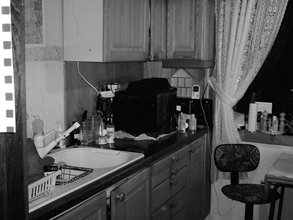</td>
</tr>
<tr>
<td>Store</td>
<td>0.44</td>
<td bgcolor=LightBlue>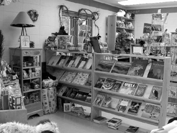</td>
<td bgcolor=LightGreen></td>
<td bgcolor=LightCoral><br><small>Forest</small></td>
<td bgcolor=#FFBB55></td>
</tr>
<tr>
<td>Bedroom</td>
<td>0.39</td>
<td bgcolor=LightBlue></td>
<td bgcolor=LightGreen></td>
<td bgcolor=LightCoral>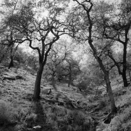<br><small>Forest</small></td>
<td bgcolor=#FFBB55></td>
</tr>
<tr>
<td>LivingRoom</td>
<td>0.37</td>
<td bgcolor=LightBlue>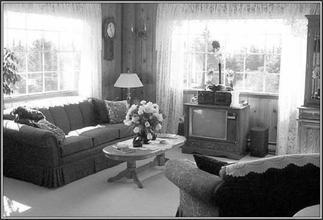</td>
<td bgcolor=LightGreen></td>
<td bgcolor=LightCoral><br><small>Coast</small></td>
<td bgcolor=#FFBB55></td>
</tr>
<tr>
<td>Office</td>
<td>0.77</td>
<td bgcolor=LightBlue>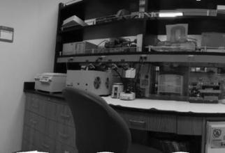</td>
<td bgcolor=LightGreen>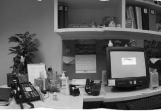</td>
<td bgcolor=LightCoral>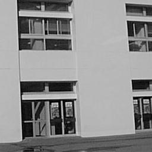<br><small>Street</small></td>
<td bgcolor=#FFBB55></td>
</tr>
<tr>
<td>Industrial</td>
<td>0.43</td>
<td bgcolor=LightBlue></td>
<td bgcolor=LightGreen></td>
<td bgcolor=LightCoral><br><small>Coast</small></td>
<td bgcolor=#FFBB55>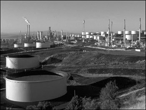</td>
</tr>
<tr>
<td>Suburb</td>
<td>0.90</td>
<td bgcolor=LightBlue></td>
<td bgcolor=LightGreen>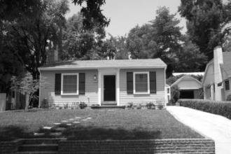</td>
<td bgcolor=LightCoral>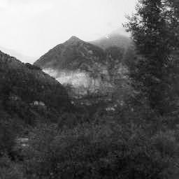<br><small>Mountain</small></td>
<td bgcolor=#FFBB55></td>
</tr>
<tr>
<td>InsideCity</td>
<td>0.41</td>
<td bgcolor=LightBlue></td>
<td bgcolor=LightGreen></td>
<td bgcolor=LightCoral><br><small>Mountain</small></td>
<td bgcolor=#FFBB55>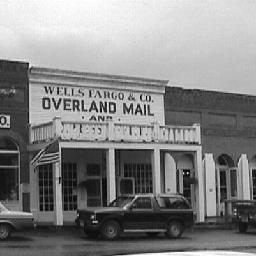</td>
</tr>
<tr>
<td>TallBuilding</td>
<td>0.64</td>
<td bgcolor=LightBlue></td>
<td bgcolor=LightGreen></td>
<td bgcolor=LightCoral><br><small>Mountain</small></td>
<td bgcolor=#FFBB55></td>
</tr>
<tr>
<td>Street</td>
<td>0.57</td>
<td bgcolor=LightBlue></td>
<td bgcolor=LightGreen></td>
<td bgcolor=LightCoral><br><small>Forest</small></td>
<td bgcolor=#FFBB55></td>
</tr>
<tr>
<td>Highway</td>
<td>0.82</td>
<td bgcolor=LightBlue></td>
<td bgcolor=LightGreen></td>
<td bgcolor=LightCoral><br><small>Mountain</small></td>
<td bgcolor=#FFBB55>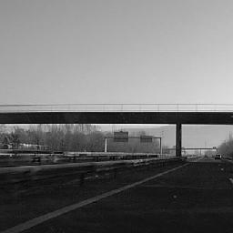</td>
</tr>
<tr>
<td>OpenCountry</td>
<td>0.60</td>
<td bgcolor=LightBlue></td>
<td bgcolor=LightGreen></td>
<td bgcolor=LightCoral>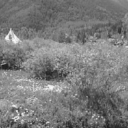<br><small>Forest</small></td>
<td bgcolor=#FFBB55></td>
</tr>
<tr>
<td>Coast</td>
<td>0.73</td>
<td bgcolor=LightBlue></td>
<td bgcolor=LightGreen></td>
<td bgcolor=LightCoral>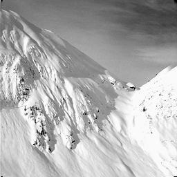<br><small>Mountain</small></td>
<td bgcolor=#FFBB55></td>
</tr>
<tr>
<td>Mountain</td>
<td>0.73</td>
<td bgcolor=LightBlue></td>
<td bgcolor=LightGreen>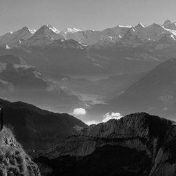</td>
<td bgcolor=LightCoral><br><small>Forest</small></td>
<td bgcolor=#FFBB55></td>
</tr>
<tr>
<td>Forest</td>
<td>0.92</td>
<td bgcolor=LightBlue></td>
<td bgcolor=LightGreen></td>
<td bgcolor=LightCoral><br><small>OpenCountry</small></td>
<td bgcolor=#FFBB55></td>
</tr>
<tr>
<th>Category name</th>
<th>Accuracy</th>
<th>Sample training images</th>
<th>Sample true positives</th>
<th>False positives with true label</th>
<th>False negatives</th>
</tr>
</table>
</center>
