

<h1>Project 3 results visualization</h1>
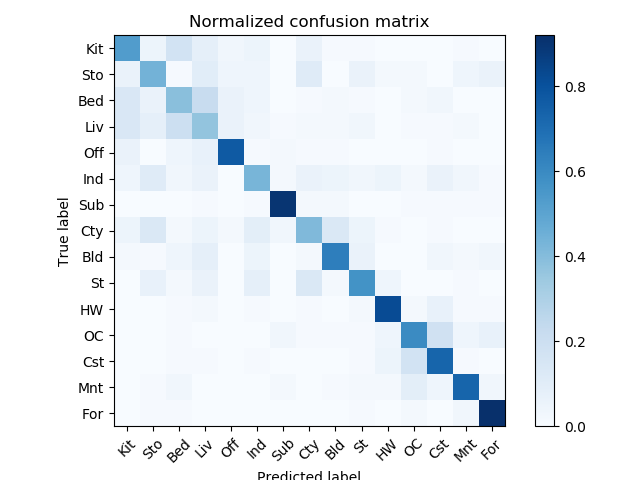

 
Accuracy(sift+svm) is 0.62
Accuracy(sift+nn) is 0.52
Accuracy(tiny+nn) is 0.21
Note: Here I only show some results of sift+svm. For other mothod combinations, please change the arguments when running the code. you can expect to get approximately 21% and 51% accuracies for tiny_image+nn and sift+nn respectively.

<table border=0 cellpadding=4 cellspacing=1>
<tr>
<th>Category name</th>
<th>Accuracy</th>
<th>Sample training images</th>
<th>Sample true positives</th>
<th>False positives with true label</th>
<th>False negatives</th>
</tr>
<tr>
<td>Kitchen</td>
<td>0.62</td>
<td bgcolor=LightBlue></td>
<td bgcolor=LightGreen></td>
<td bgcolor=LightCoral> <small>TallBuilding</small></td>
<td bgcolor=#FFBB55></td>
</tr>
<tr>
<td>Store</td>
<td>0.44</td>
<td bgcolor=LightBlue></td>
<td bgcolor=LightGreen></td>
<td bgcolor=LightCoral>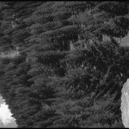 <small>Forest</small></td>
<td bgcolor=#FFBB55>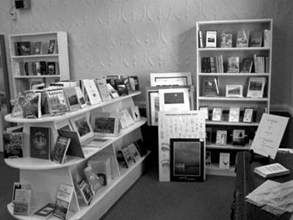</td>
</tr>
<tr>
<td>Bedroom</td>
<td>0.39</td>
<td bgcolor=LightBlue></td>
<td bgcolor=LightGreen></td>
<td bgcolor=LightCoral>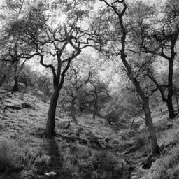 <small>Forest</small></td>
<td bgcolor=#FFBB55>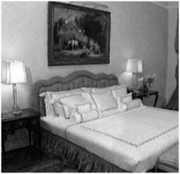</td>
</tr>
<tr>
<td>LivingRoom</td>
<td>0.37</td>
<td bgcolor=LightBlue></td>
<td bgcolor=LightGreen></td>
<td bgcolor=LightCoral> <small>Coast</small></td>
<td bgcolor=#FFBB55>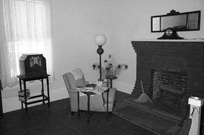</td>
</tr>
<tr>
<td>Office</td>
<td>0.77</td>
<td bgcolor=LightBlue></td>
<td bgcolor=LightGreen></td>
<td bgcolor=LightCoral> <small>Street</small></td>
<td bgcolor=#FFBB55></td>
</tr>
<tr>
<td>Industrial</td>
<td>0.43</td>
<td bgcolor=LightBlue></td>
<td bgcolor=LightGreen></td>
<td bgcolor=LightCoral> <small>Coast</small></td>
<td bgcolor=#FFBB55>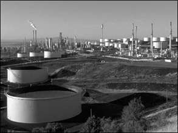</td>
</tr>
<tr>
<td>Suburb</td>
<td>0.90</td>
<td bgcolor=LightBlue></td>
<td bgcolor=LightGreen>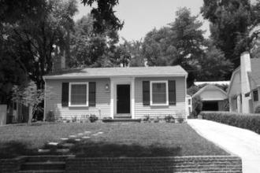</td>
<td bgcolor=LightCoral> <small>Mountain</small></td>
<td bgcolor=#FFBB55></td>
</tr>
<tr>
<td>InsideCity</td>
<td>0.41</td>
<td bgcolor=LightBlue></td>
<td bgcolor=LightGreen></td>
<td bgcolor=LightCoral> <small>Mountain</small></td>
<td bgcolor=#FFBB55>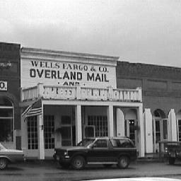</td>
</tr>
<tr>
<td>TallBuilding</td>
<td>0.64</td>
<td bgcolor=LightBlue></td>
<td bgcolor=LightGreen></td>
<td bgcolor=LightCoral> <small>Mountain</small></td>
<td bgcolor=#FFBB55></td>
</tr>
<tr>
<td>Street</td>
<td>0.57</td>
<td bgcolor=LightBlue></td>
<td bgcolor=LightGreen>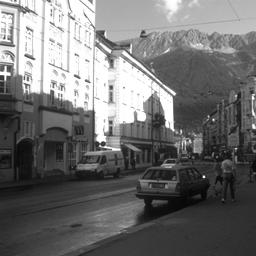</td>
<td bgcolor=LightCoral> <small>Forest</small></td>
<td bgcolor=#FFBB55></td>
</tr>
<tr>
<td>Highway</td>
<td>0.82</td>
<td bgcolor=LightBlue></td>
<td bgcolor=LightGreen></td>
<td bgcolor=LightCoral> <small>Mountain</small></td>
<td bgcolor=#FFBB55>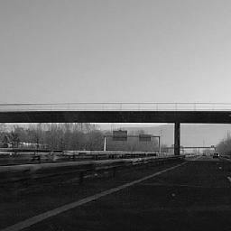</td>
</tr>
<tr>
<td>OpenCountry</td>
<td>0.60</td>
<td bgcolor=LightBlue>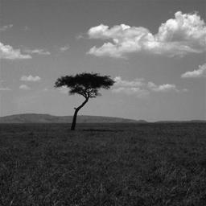</td>
<td bgcolor=LightGreen>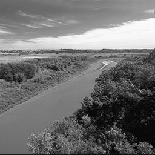</td>
<td bgcolor=LightCoral> <small>Forest</small></td>
<td bgcolor=#FFBB55></td>
</tr>
<tr>
<td>Coast</td>
<td>0.73</td>
<td bgcolor=LightBlue></td>
<td bgcolor=LightGreen>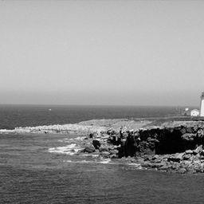</td>
<td bgcolor=LightCoral> <small>Mountain</small></td>
<td bgcolor=#FFBB55></td>
</tr>
<tr>
<td>Mountain</td>
<td>0.73</td>
<td bgcolor=LightBlue>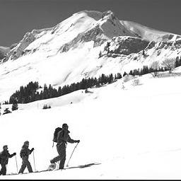</td>
<td bgcolor=LightGreen></td>
<td bgcolor=LightCoral> <small>Forest</small></td>
<td bgcolor=#FFBB55>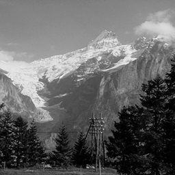</td>
</tr>
<tr>
<td>Forest</td>
<td>0.92</td>
<td bgcolor=LightBlue></td>
<td bgcolor=LightGreen></td>
<td bgcolor=LightCoral>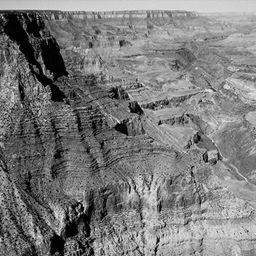 <small>OpenCountry</small></td>
<td bgcolor=#FFBB55>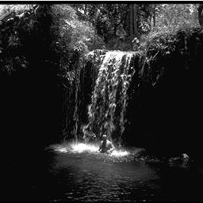</td>
</tr>
<tr>
<th>Category name</th>
<th>Accuracy</th>
<th>Sample training images</th>
<th>Sample true positives</th>
<th>False positives with true label</th>
<th>False negatives</th>
</tr>
</table>

